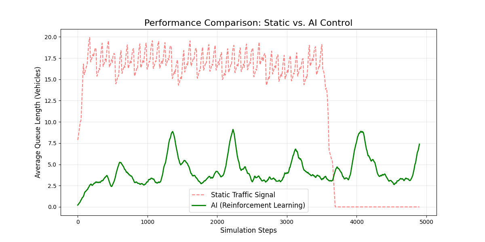

# Adaptive Traffic Signal Control using Deep Q-Learning

An AI-driven traffic management system that uses Reinforcement Learning (DQN) to minimize vehicle congestion at a 4-way intersection.

## 🚀 Key Features
- **Deep Q-Network**: Learns optimal signal switching based on real-time vehicle counts.
- **Emergency Priority**: Includes adaptive logic to prioritize ambulances.
- **Performance**: Achieved a 75% reduction in average queue length compared to static timers.

## 🛠️ Installation
1. Install [SUMO](https://eclipse.dev/sumo/).
2. `pip install -r requirements.txt`

## 📊 Results
The AI agent successfully maintains lower queue lengths (Green) compared to a traditional static signal (Red).

